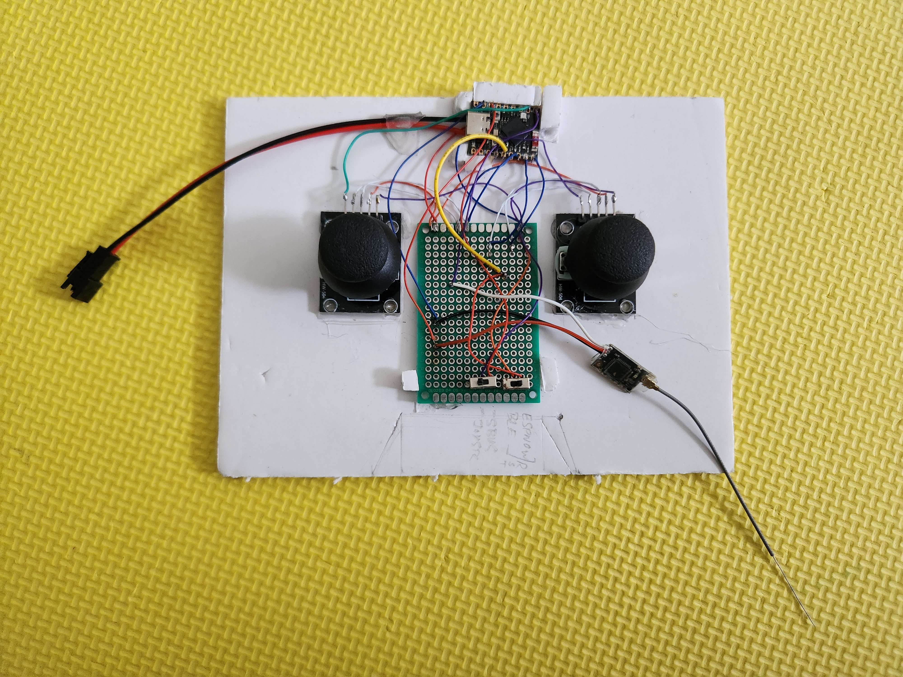

# Controller Project esp32-s3 based

## Components
* esp32-s3 supermini (primarily as it has lipo input)
* arduino joystick
* sbus receiver aliexpress

## Controller Features:

* 1 switch to toggle between input methods arduino joystick vs DSMX sbus
* 1 switch to toggle between transmitter method BLE HID vs esp-now.
* Constantly posts to Wifi address to control bicopter

Controller is also custom using esp-now protocol and cheap arduino joysticks (Big Mistake). If anyone is planning to build this DO NOT use the cheap arduino joysticks as they are not electronically centered. (I get 111 as center in the scale of 255). I did have to come up with some calibration logic for my bicopter. But for this plane its still flyable.

DSMX sbus receiver support - I do have provision to attach a dsmx sbus receiver in that board which I use with MLP6DSM controller. But I feel the response time is too slow for indoor flying. So I never use that one. There are a lot of dropped frames.
A little note about this sbus receiver - The start bits is 0X0F and stop bits are 0x00.

## Image:

## Receiver Usage:
* [esp32 control plane](https://github.com/samarjit/esp32-c6-receiver)
* Flight Simulators [picasim](https://www.rowlhouse.co.uk/PicaSim/) using BLE HID. I used both arduino input and sbus for picasim successfully.
* [BiCopter](https://github.com/samarjit/esp32-c6-bicopter). This I use wifi to connect to it as I wanted this to be indoor only. Also I wanted to view the statistics in browser using a esp32 web server.
